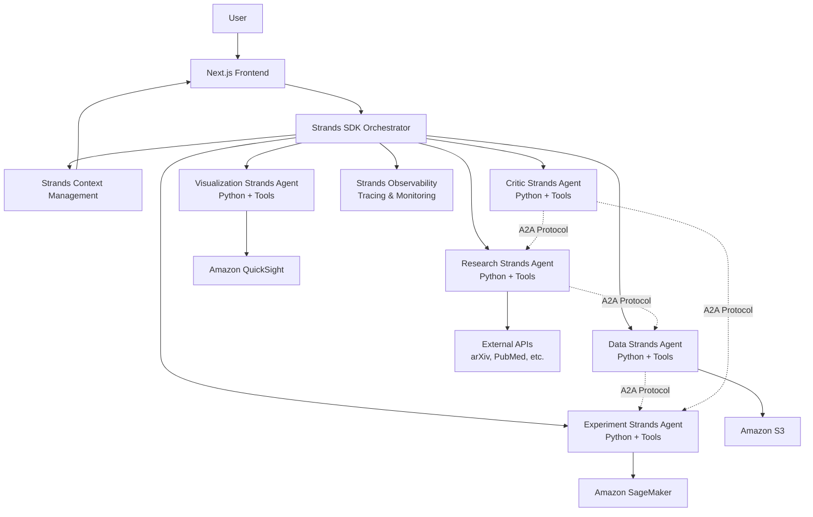
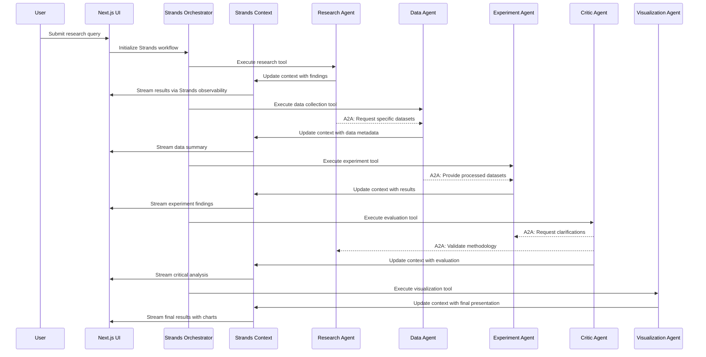

# Design Document

## Overview

The AI Scientist Team system is a sophisticated multi-agent research platform that leverages Strands SDK to automate the entire research lifecycle. The system orchestrates five specialized Python-based agents through Strands SDK's native orchestration capabilities, providing transparent, step-by-step research execution with real-time visibility through a Next.js frontend.

The architecture follows a hybrid workflow pattern combining sequential execution with Agent-to-Agent (A2A) communication, where each agent builds upon previous work while also enabling direct peer communication. All coordination is managed through Strands SDK's built-in context management and observability features, ensuring consistency, traceability, and production-ready error handling.

## Architecture

### High-Level Architecture



### Agent Orchestration Flow



## Components and Interfaces

### 1. Strands SDK Orchestrator

**Purpose:** Central orchestration engine using Strands SDK's native agent management

**Key Responsibilities:**
- Agent-as-tools workflow coordination and execution
- Strands context management and state persistence
- Built-in error handling and retry mechanisms with Strands SDK
- Agent lifecycle management through Strands agent framework

**Implementation:**
```python
from strands import Agent

orchestrator = Agent(
    system_prompt="Route research queries to specialized agents based on workflow stage",
    tools=[research_agent, data_agent, experiment_agent, critic_agent, viz_agent],
    callback_handler=StrandsObservabilityHandler()
)
```

**Interfaces:**
- REST API endpoints for Next.js frontend communication
- Strands SDK native agent management and tool execution
- Strands context read/write operations with automatic persistence
- Cloud-agnostic service integration through Strands tools

### 2. Research Strands Agent (Python)

**Purpose:** Hypothesis formulation and literature research using Strands agent framework

**Implementation:**
```python
from strands import Agent

# Define research tools
def arxiv_search_tool(query: str) -> str:
    """Search arXiv for academic papers"""
    # Implementation using arXiv API
    pass

def pubmed_search_tool(query: str) -> str:
    """Search PubMed for medical research"""
    # Implementation using PubMed API
    pass

def hypothesis_generator_tool(research_context: str) -> str:
    """Generate testable hypotheses from research context"""
    # Implementation using LLM reasoning
    pass

# Create Strands research agent
research_agent = Agent(
    system_prompt="""You are a research specialist agent. Use your tools to:
    1. Generate testable hypotheses from user queries
    2. Search academic literature for relevant papers
    3. Synthesize findings into structured research context
    Always provide citations and confidence scores.""",
    tools=[arxiv_search_tool, pubmed_search_tool, hypothesis_generator_tool]
)
```

**External Integrations:**
- arXiv API for academic papers
- PubMed for medical research
- Semantic Scholar for cross-disciplinary research
- Google Scholar API (if available)

### 3. Data Strands Agent (Python)

**Purpose:** Dataset discovery, acquisition, and preprocessing using Strands tools

**Implementation:**
```python
from strands import Agent

# Define data collection tools
def kaggle_search_tool(query: str) -> str:
    """Search Kaggle for relevant datasets"""
    # Implementation using Kaggle API
    pass

def huggingface_search_tool(query: str) -> str:
    """Search HuggingFace for datasets"""
    # Implementation using HuggingFace API
    pass

def data_cleaning_tool(dataset_path: str) -> str:
    """Clean and preprocess dataset using pandas"""
    # Implementation with pandas/numpy
    pass

def s3_storage_tool(processed_data: str, metadata: str) -> str:
    """Store processed data in S3 with metadata"""
    # Implementation using boto3
    pass

# Create Strands data agent
data_agent = Agent(
    system_prompt="""You are a data specialist agent. Use your tools to:
    1. Discover relevant datasets from multiple sources
    2. Assess data quality and relevance
    3. Clean and preprocess data for analysis
    4. Store processed data with proper metadata
    Always provide data quality reports and processing summaries.""",
    tools=[kaggle_search_tool, huggingface_search_tool, data_cleaning_tool, s3_storage_tool]
)
```

**Data Processing Pipeline:**
- Data discovery and relevance scoring
- Quality assessment and validation
- Cleaning and normalization using pandas
- Feature engineering and transformation
- Metadata generation and cataloging

### 4. Experiment Strands Agent (Python)

**Purpose:** Automated experimentation and analysis execution using Strands tools

**Implementation:**
```python
from strands import Agent

# Define experiment tools
def experiment_design_tool(hypotheses: str, data_context: str) -> str:
    """Design appropriate experiments based on hypotheses and available data"""
    # Implementation using statistical design principles
    pass

def sagemaker_training_tool(experiment_config: str) -> str:
    """Execute ML training jobs on SageMaker"""
    # Implementation using SageMaker Python SDK
    pass

def statistical_analysis_tool(experiment_data: str) -> str:
    """Perform statistical analysis using scipy/statsmodels"""
    # Implementation with statistical libraries
    pass

def results_interpretation_tool(analysis_results: str) -> str:
    """Interpret experimental results and generate insights"""
    # Implementation using domain knowledge and statistical reasoning
    pass

# Create Strands experiment agent
experiment_agent = Agent(
    system_prompt="""You are an experiment specialist agent. Use your tools to:
    1. Design rigorous experiments based on research hypotheses
    2. Execute experiments using appropriate statistical and ML methods
    3. Analyze results with proper statistical interpretation
    4. Generate actionable insights and recommendations
    Always include confidence intervals and statistical significance testing.""",
    tools=[experiment_design_tool, sagemaker_training_tool, statistical_analysis_tool, results_interpretation_tool]
)
```

**Experiment Types:**
- Statistical hypothesis testing
- Machine learning model training and evaluation
- A/B testing and comparative analysis
- Simulation and Monte Carlo methods
- Time series analysis and forecasting

### 5. Critic Strands Agent (Python)

**Purpose:** Quality assurance and critical evaluation using Strands tools and A2A communication

**Implementation:**
```python
from strands import Agent

# Define critic tools
def methodology_validator_tool(experiment_design: str) -> str:
    """Evaluate experimental methodology for validity and rigor"""
    # Implementation using research methodology principles
    pass

def bias_detector_tool(research_context: str) -> str:
    """Detect potential biases in data, methodology, or interpretation"""
    # Implementation using bias detection algorithms
    pass

def statistical_validator_tool(results: str) -> str:
    """Validate statistical analysis and significance testing"""
    # Implementation using statistical validation methods
    pass

def reproducibility_checker_tool(full_workflow: str) -> str:
    """Assess reproducibility and generalizability of findings"""
    # Implementation using reproducibility frameworks
    pass

# Create Strands critic agent with A2A capabilities
critic_agent = Agent(
    system_prompt="""You are a critical evaluation specialist agent. Use your tools to:
    1. Evaluate research methodology for validity and rigor
    2. Detect potential biases and confounding factors
    3. Validate statistical analyses and interpretations
    4. Assess reproducibility and generalizability
    Use A2A communication to request clarifications from other agents when needed.
    Always provide constructive feedback and confidence scores.""",
    tools=[methodology_validator_tool, bias_detector_tool, statistical_validator_tool, reproducibility_checker_tool]
)
```

**Evaluation Criteria:**
- Statistical significance and power analysis
- Effect size and practical significance
- Bias detection and mitigation assessment
- Reproducibility and generalizability
- Data quality and completeness evaluation

### 6. Visualization Strands Agent (Python)

**Purpose:** Generate comprehensive visualizations and reports using Strands tools

**Implementation:**
```python
from strands import Agent

# Define visualization tools
def chart_generator_tool(data: str, chart_type: str) -> str:
    """Generate charts using matplotlib, plotly, or seaborn"""
    # Implementation with multiple visualization libraries
    pass

def dashboard_creator_tool(visualizations: str) -> str:
    """Create interactive dashboards combining multiple visualizations"""
    # Implementation using plotly dash or similar
    pass

def quicksight_integration_tool(data_source: str) -> str:
    """Create advanced dashboards in AWS QuickSight"""
    # Implementation using QuickSight API
    pass

def report_generator_tool(research_context: str) -> str:
    """Generate comprehensive research reports with findings and visualizations"""
    # Implementation creating PDF/HTML reports
    pass

# Create Strands visualization agent
viz_agent = Agent(
    system_prompt="""You are a visualization specialist agent. Use your tools to:
    1. Create appropriate charts and graphs for research findings
    2. Build interactive dashboards for data exploration
    3. Generate comprehensive research reports
    4. Ensure visualizations clearly communicate key insights
    Always prioritize clarity, accuracy, and visual appeal in your outputs.""",
    tools=[chart_generator_tool, dashboard_creator_tool, quicksight_integration_tool, report_generator_tool]
)
```

**Visualization Types:**
- Statistical plots (distributions, correlations, hypothesis tests)
- Machine learning visualizations (ROC curves, feature importance)
- Interactive dashboards with drill-down capabilities
- Comparative analysis charts
- Confidence interval and uncertainty visualizations

### 7. Next.js Frontend with Strands Integration

**Purpose:** User interface for Strands agent workflow management and result visualization

**Key Components:**
- **Research Query Interface:** Form for submitting research questions to Strands orchestrator
- **Strands Agent Progress Tracker:** Real-time status using Strands observability features
- **Agent Conversation History:** Display of Strands agent interactions and A2A communications
- **Interactive Results Panels:** Step-by-step presentation of Strands agent outputs
- **Agent Intervention Controls:** Allow users to modify agent behavior mid-execution
- **Strands Context Viewer:** Real-time display of shared context and agent state

**Technology Stack:**
- Next.js 14 with App Router
- TailwindCSS for styling
- React Query for state management
- Plotly.js for interactive charts
- Strands SDK streaming API for real-time updates
- WebSocket connections for Strands agent communication

## Data Models

### Strands Context Schema

```python
@dataclass
class StrandsResearchContext:
    session_id: str
    query: str
    timestamp: datetime
    status: WorkflowStatus
    current_agent: str
    conversation_history: List[StrandsMessage]
    a2a_communications: List[A2AMessage]
    
    # Agent outputs managed by Strands context
    research_findings: Optional[ResearchFindings]
    data_context: Optional[DataContext]
    experiment_results: Optional[ExperimentResults]
    critical_evaluation: Optional[CriticalEvaluation]
    visualizations: Optional[VisualizationResults]

@dataclass
class StrandsMessage:
    agent_name: str
    message_type: str  # tool_call, tool_result, agent_response
    content: str
    timestamp: datetime
    trace_id: str

@dataclass
class A2AMessage:
    from_agent: str
    to_agent: str
    message_content: str
    response_content: Optional[str]
    timestamp: datetime

@dataclass
class ResearchFindings:
    hypotheses: List[Hypothesis]
    literature_review: LiteratureReview
    research_gaps: List[str]
    confidence_score: float

@dataclass
class DataContext:
    datasets: List[DatasetMetadata]
    data_quality_report: DataQualityReport
    preprocessing_steps: List[PreprocessingStep]
    s3_locations: List[S3Location]

@dataclass
class ExperimentResults:
    experiments: List[Experiment]
    statistical_results: StatisticalResults
    model_performance: Optional[ModelPerformance]
    confidence_intervals: Dict[str, ConfidenceInterval]
```

### Cloud Service Integration Models (Cloud-Agnostic via Strands)

```python
# Cloud Storage (S3, GCS, Azure Blob)
@dataclass
class CloudStorageLocation:
    provider: str  # aws, gcp, azure
    bucket: str
    key: str
    metadata: Dict[str, Any]
    size_bytes: int
    last_modified: datetime

# ML Platform Integration (SageMaker, Vertex AI, Azure ML)
@dataclass
class MLJob:
    job_name: str
    job_type: str  # training, processing, inference
    status: str
    platform: str  # sagemaker, vertex_ai, azure_ml
    instance_type: str
    output_location: CloudStorageLocation

# Strands Tool Integration
@dataclass
class StrandsTool:
    name: str
    description: str
    parameters: Dict[str, Any]
    implementation: Callable
    error_handler: Optional[Callable]
```

## Error Handling

### Strands SDK Error Handling

```python
from strands import Agent, ErrorHandler

class StrandsAgentErrorHandler(ErrorHandler):
    def __init__(self, agent_name: str):
        self.agent_name = agent_name
        # Strands SDK provides built-in retry and circuit breaker patterns
        super().__init__(
            retry_config={'max_attempts': 3, 'backoff_factor': 2},
            circuit_breaker_config={'failure_threshold': 5, 'timeout': 60}
        )
    
    def handle_tool_error(self, tool_name: str, error: Exception, context: Dict) -> ErrorResponse:
        # Leverage Strands SDK's built-in error handling and logging
        return self.default_error_handler(tool_name, error, context)
    
    def implement_fallback_strategy(self, failed_tool: str, context: Dict) -> FallbackResult:
        # Use Strands SDK's fallback mechanism for tool failures
        return self.execute_fallback_tool(failed_tool, context)

# Enhanced agent creation with error handling
research_agent = Agent(
    system_prompt="Research specialist with robust error handling",
    tools=[arxiv_search_tool, pubmed_search_tool, hypothesis_generator_tool],
    error_handler=StrandsAgentErrorHandler("research_agent")
)
```

### Strands SDK System-Level Error Recovery

- **Built-in Graceful Degradation:** Strands SDK automatically continues workflow with partial results
- **Conversation Checkpointing:** Resume from any point in the agent conversation history
- **Tool Fallback Chains:** Automatic fallback to alternative tools when primary tools fail
- **A2A Error Recovery:** Agents can request help from peer agents when encountering errors
- **User Intervention Integration:** Strands SDK supports mid-conversation user input for error resolution

### Cloud-Agnostic Service Error Handling

- **Multi-Cloud Resilience:** Automatic failover between cloud providers through Strands tools
- **Rate Limiting Management:** Built-in exponential backoff and request throttling via Strands SDK
- **Cost Monitoring Integration:** Strands observability includes cost tracking across providers
- **Permission Error Handling:** Clear error messages with provider-specific permission guidance
- **Service Health Monitoring:** Automatic service health checks and circuit breaker patterns

## Testing Strategy

### Unit Testing with Strands SDK

```python
from strands.testing import AgentTestFramework, MockTool

# Example test structure for Strands Research Agent
class TestStrandsResearchAgent:
    def setup_method(self):
        self.test_framework = AgentTestFramework()
        self.mock_arxiv = MockTool("arxiv_search_tool")
        self.mock_pubmed = MockTool("pubmed_search_tool")
    
    def test_hypothesis_generation_tool(self):
        # Test hypothesis generation tool with Strands testing framework
        result = self.test_framework.test_tool(
            tool=hypothesis_generator_tool,
            input_data="machine learning bias",
            expected_output_pattern="hypothesis.*testable"
        )
        assert result.success
    
    def test_agent_conversation_flow(self):
        # Test complete agent conversation using Strands conversation replay
        conversation = self.test_framework.replay_conversation(
            agent=research_agent,
            conversation_file="test_research_conversation.json"
        )
        assert conversation.completed_successfully
    
    def test_a2a_communication(self):
        # Test Agent-to-Agent communication patterns
        a2a_result = self.test_framework.test_a2a_interaction(
            from_agent=research_agent,
            to_agent=data_agent,
            message="Request datasets for machine learning bias research"
        )
        assert a2a_result.response_received
```

### Integration Testing with Strands SDK

- **A2A Communication Testing:** Test direct agent-to-agent communication using Strands A2A protocol
- **Multi-Cloud Service Integration:** Test cloud service connections through Strands tools across providers
- **Strands Context Integration:** Test context sharing and persistence through Strands SDK
- **Frontend-Strands Integration:** Test real-time updates using Strands streaming and observability APIs
- **End-to-End Strands Workflow:** Test complete research workflow using Strands conversation orchestration

### Performance Testing with Strands SDK

- **Concurrent Agent Load:** Test Strands orchestrator behavior with multiple simultaneous agent executions
- **Large Context Handling:** Test Strands context management with large conversation histories
- **Multi-Cloud Service Limits:** Test behavior at various cloud service quotas through Strands tools
- **Strands Memory Management:** Monitor Strands context growth, summarization, and cleanup
- **A2A Communication Performance:** Test latency and throughput of agent-to-agent communications

### Security Testing with Strands SDK

- **Multi-Cloud Permission Validation:** Test least-privilege access across cloud providers through Strands tools
- **Strands Context Security:** Verify encryption and access control for agent conversations and context
- **Tool Security Validation:** Test authentication and authorization for all Strands tools
- **Input Sanitization:** Test Strands SDK's built-in input validation and sanitization features

### Monitoring and Observability with Strands SDK

- **Strands Agent Metrics:** Built-in execution time, success rates, tool performance tracking
- **Multi-Cloud Resource Monitoring:** Cost and usage tracking across providers through Strands observability
- **Conversation Analytics:** User interaction patterns, agent effectiveness, workflow completion rates
- **Strands Health Dashboards:** Real-time monitoring of agent health, tool performance, and system status
- **A2A Communication Monitoring:** Track agent-to-agent interaction patterns and performance
- **Distributed Tracing:** End-to-end request tracing through Strands agent workflows