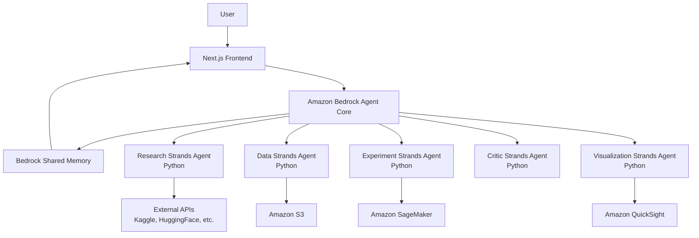
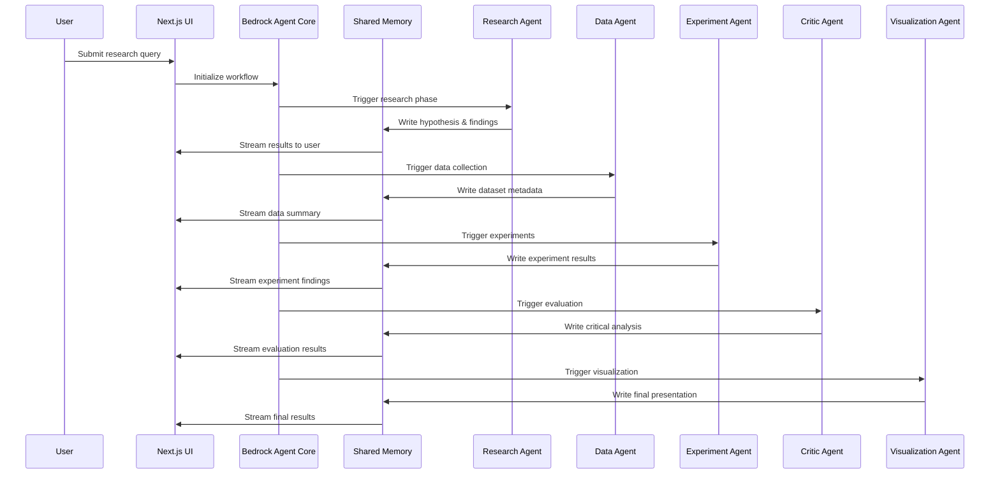

# Design Document

## Overview

The AI Scientist Team system is a sophisticated multi-agent research platform that leverages Amazon Bedrock Strands agents to automate the entire research lifecycle. The system orchestrates five specialized Python-based agents through Amazon Bedrock Agent Core, providing transparent, step-by-step research execution with real-time visibility through a Next.js frontend.

The architecture follows a sequential workflow pattern where each agent builds upon the previous agent's work, with all communication mediated through Bedrock's shared memory system. This design ensures consistency, traceability, and allows for sophisticated error handling and recovery mechanisms.

## Architecture

### High-Level Architecture



### Agent Orchestration Flow



## Components and Interfaces

### 1. Amazon Bedrock Agent Core (Orchestrator)

**Purpose:** Central orchestration engine that manages agent workflow and shared memory

**Key Responsibilities:**
- Workflow state management and agent sequencing
- Shared memory coordination and access control
- Error handling and recovery mechanisms
- Agent lifecycle management

**Interfaces:**
- REST API endpoints for Next.js frontend communication
- Bedrock Strands Agent SDK for agent management
- Shared memory read/write operations
- AWS service integration points

### 2. Research Strands Agent (Python)

**Purpose:** Hypothesis formulation and literature research

**Key Components:**
```python
class ResearchAgent:
    def __init__(self, bedrock_client, shared_memory):
        self.bedrock_client = bedrock_client
        self.shared_memory = shared_memory
        self.research_apis = {
            'arxiv': ArxivAPI(),
            'pubmed': PubMedAPI(),
            'semantic_scholar': SemanticScholarAPI()
        }
    
    def formulate_hypothesis(self, query: str) -> List[Hypothesis]:
        # Generate testable hypotheses based on query
        pass
    
    def search_literature(self, hypotheses: List[Hypothesis]) -> ResearchFindings:
        # Search academic databases and repositories
        pass
    
    def write_findings(self, findings: ResearchFindings) -> None:
        # Write structured findings to shared memory
        pass
```

**External Integrations:**
- arXiv API for academic papers
- PubMed for medical research
- Semantic Scholar for cross-disciplinary research
- Google Scholar API (if available)

### 3. Data Strands Agent (Python)

**Purpose:** Dataset discovery, acquisition, and preprocessing

**Key Components:**
```python
class DataAgent:
    def __init__(self, bedrock_client, shared_memory, s3_client):
        self.bedrock_client = bedrock_client
        self.shared_memory = shared_memory
        self.s3_client = s3_client
        self.data_sources = {
            'kaggle': KaggleAPI(),
            'huggingface': HuggingFaceAPI(),
            'aws_open_data': AWSOpenDataAPI()
        }
    
    def discover_datasets(self, research_context: ResearchContext) -> List[Dataset]:
        # Find relevant datasets from multiple sources
        pass
    
    def preprocess_data(self, datasets: List[Dataset]) -> ProcessedDataset:
        # Clean, validate, and format data using pandas/numpy
        pass
    
    def store_in_s3(self, processed_data: ProcessedDataset) -> S3Location:
        # Store processed datasets in S3 with metadata
        pass
```

**Data Processing Pipeline:**
- Data discovery and relevance scoring
- Quality assessment and validation
- Cleaning and normalization using pandas
- Feature engineering and transformation
- Metadata generation and cataloging

### 4. Experiment Strands Agent (Python)

**Purpose:** Automated experimentation and analysis execution

**Key Components:**
```python
class ExperimentAgent:
    def __init__(self, bedrock_client, shared_memory, sagemaker_client):
        self.bedrock_client = bedrock_client
        self.shared_memory = shared_memory
        self.sagemaker_client = sagemaker_client
        self.experiment_types = {
            'statistical': StatisticalAnalysis(),
            'ml_modeling': MLModelingPipeline(),
            'simulation': SimulationEngine()
        }
    
    def design_experiments(self, hypotheses: List[Hypothesis], 
                          data_context: DataContext) -> ExperimentPlan:
        # Design appropriate experiments based on hypotheses and data
        pass
    
    def execute_experiments(self, plan: ExperimentPlan) -> ExperimentResults:
        # Run experiments using SageMaker and local compute
        pass
    
    def analyze_results(self, results: ExperimentResults) -> Analysis:
        # Statistical analysis and interpretation
        pass
```

**Experiment Types:**
- Statistical hypothesis testing
- Machine learning model training and evaluation
- A/B testing and comparative analysis
- Simulation and Monte Carlo methods
- Time series analysis and forecasting

### 5. Critic Strands Agent (Python)

**Purpose:** Quality assurance and critical evaluation of results

**Key Components:**
```python
class CriticAgent:
    def __init__(self, bedrock_client, shared_memory):
        self.bedrock_client = bedrock_client
        self.shared_memory = shared_memory
        self.evaluation_frameworks = {
            'statistical_validity': StatisticalValidator(),
            'bias_detection': BiasDetector(),
            'reproducibility': ReproducibilityChecker()
        }
    
    def evaluate_methodology(self, experiment_context: ExperimentContext) -> MethodologyEvaluation:
        # Assess experimental design and methodology
        pass
    
    def validate_results(self, results: ExperimentResults) -> ValidationReport:
        # Check statistical significance, effect sizes, confidence intervals
        pass
    
    def identify_limitations(self, full_context: ResearchContext) -> List[Limitation]:
        # Identify potential biases, confounding factors, and limitations
        pass
```

**Evaluation Criteria:**
- Statistical significance and power analysis
- Effect size and practical significance
- Bias detection and mitigation assessment
- Reproducibility and generalizability
- Data quality and completeness evaluation

### 6. Visualization Strands Agent (Python)

**Purpose:** Generate comprehensive visualizations and final presentation

**Key Components:**
```python
class VisualizationAgent:
    def __init__(self, bedrock_client, shared_memory, quicksight_client):
        self.bedrock_client = bedrock_client
        self.shared_memory = shared_memory
        self.quicksight_client = quicksight_client
        self.viz_engines = {
            'matplotlib': MatplotlibRenderer(),
            'plotly': PlotlyRenderer(),
            'seaborn': SeabornRenderer()
        }
    
    def generate_visualizations(self, analysis_results: AnalysisResults) -> List[Visualization]:
        # Create appropriate charts and graphs
        pass
    
    def create_dashboard(self, visualizations: List[Visualization]) -> Dashboard:
        # Combine visualizations into coherent dashboard
        pass
    
    def generate_report(self, full_context: ResearchContext) -> ResearchReport:
        # Create comprehensive research report with findings
        pass
```

**Visualization Types:**
- Statistical plots (distributions, correlations, hypothesis tests)
- Machine learning visualizations (ROC curves, feature importance)
- Interactive dashboards with drill-down capabilities
- Comparative analysis charts
- Confidence interval and uncertainty visualizations

### 7. Next.js Frontend

**Purpose:** User interface for research workflow management and result visualization

**Key Components:**
- **Research Query Interface:** Form for submitting research questions
- **Workflow Progress Tracker:** Real-time status of each agent's progress
- **Results Display Panels:** Step-by-step presentation of agent outputs
- **Interactive Visualizations:** Embedded charts and dashboards
- **Export and Sharing Tools:** Download reports and share findings

**Technology Stack:**
- Next.js 14 with App Router
- TailwindCSS for styling
- React Query for state management
- Plotly.js for interactive charts
- WebSocket connections for real-time updates

## Data Models

### Shared Memory Schema

```python
@dataclass
class ResearchContext:
    session_id: str
    query: str
    timestamp: datetime
    status: WorkflowStatus
    current_agent: str
    
    # Agent outputs
    research_findings: Optional[ResearchFindings]
    data_context: Optional[DataContext]
    experiment_results: Optional[ExperimentResults]
    critical_evaluation: Optional[CriticalEvaluation]
    visualizations: Optional[VisualizationResults]

@dataclass
class ResearchFindings:
    hypotheses: List[Hypothesis]
    literature_review: LiteratureReview
    research_gaps: List[str]
    confidence_score: float

@dataclass
class DataContext:
    datasets: List[DatasetMetadata]
    data_quality_report: DataQualityReport
    preprocessing_steps: List[PreprocessingStep]
    s3_locations: List[S3Location]

@dataclass
class ExperimentResults:
    experiments: List[Experiment]
    statistical_results: StatisticalResults
    model_performance: Optional[ModelPerformance]
    confidence_intervals: Dict[str, ConfidenceInterval]
```

### AWS Service Integration Models

```python
# S3 Data Storage
@dataclass
class S3Location:
    bucket: str
    key: str
    metadata: Dict[str, Any]
    size_bytes: int
    last_modified: datetime

# SageMaker Integration
@dataclass
class SageMakerJob:
    job_name: str
    job_type: str  # training, processing, inference
    status: str
    instance_type: str
    output_location: S3Location
```

## Error Handling

### Agent-Level Error Handling

```python
class AgentErrorHandler:
    def __init__(self, agent_name: str, shared_memory: SharedMemory):
        self.agent_name = agent_name
        self.shared_memory = shared_memory
        self.retry_config = RetryConfig(max_attempts=3, backoff_factor=2)
    
    def handle_execution_error(self, error: Exception, context: Dict) -> ErrorResponse:
        # Log error, update shared memory, determine recovery strategy
        pass
    
    def implement_fallback(self, original_task: Task) -> FallbackResult:
        # Implement alternative approaches when primary method fails
        pass
```

### System-Level Error Recovery

- **Graceful Degradation:** Continue workflow with partial results when non-critical components fail
- **Checkpoint Recovery:** Resume from last successful agent completion
- **Alternative Data Sources:** Fallback to different APIs/datasets when primary sources fail
- **Manual Intervention Points:** Allow users to provide input when automated recovery isn't possible

### AWS Service Error Handling

- **Service Unavailability:** Queue operations and retry when services recover
- **Rate Limiting:** Implement exponential backoff and request throttling
- **Cost Management:** Monitor and alert on unexpected cost increases
- **Permission Errors:** Clear error messages with suggested IAM policy fixes

## Testing Strategy

### Unit Testing

```python
# Example test structure for Research Agent
class TestResearchAgent:
    def test_hypothesis_generation(self):
        # Test hypothesis formulation logic
        pass
    
    def test_literature_search(self):
        # Test API integration and result parsing
        pass
    
    def test_shared_memory_integration(self):
        # Test reading from and writing to shared memory
        pass
```

### Integration Testing

- **Agent-to-Agent Communication:** Test data flow through shared memory
- **AWS Service Integration:** Test S3, SageMaker, and QuickSight connections
- **Frontend-Backend Integration:** Test real-time updates and data synchronization
- **End-to-End Workflow:** Test complete research workflow with sample queries

### Performance Testing

- **Concurrent User Load:** Test system behavior with multiple simultaneous research sessions
- **Large Dataset Handling:** Test performance with various dataset sizes
- **AWS Service Limits:** Test behavior at service quotas and rate limits
- **Memory Usage:** Monitor shared memory growth and cleanup

### Security Testing

- **IAM Permission Validation:** Test least-privilege access patterns
- **Data Encryption:** Verify encryption at rest and in transit
- **API Security:** Test authentication and authorization mechanisms
- **Input Validation:** Test against malicious inputs and injection attacks

### Monitoring and Observability

- **Agent Performance Metrics:** Execution time, success rates, error frequencies
- **AWS Service Utilization:** Cost tracking, resource usage, service health
- **User Experience Metrics:** Workflow completion rates, user satisfaction scores
- **System Health Dashboards:** Real-time monitoring of all system components